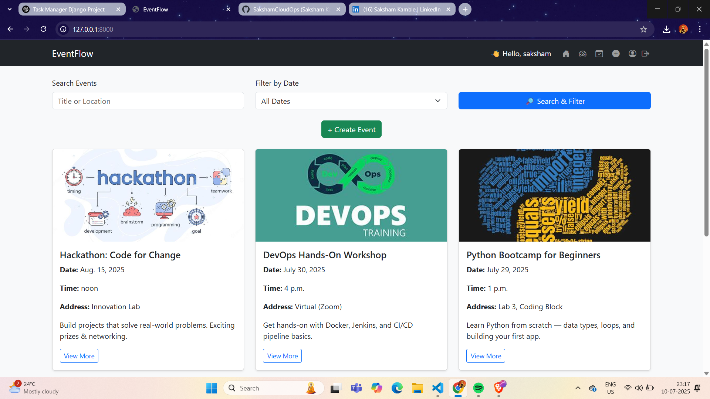
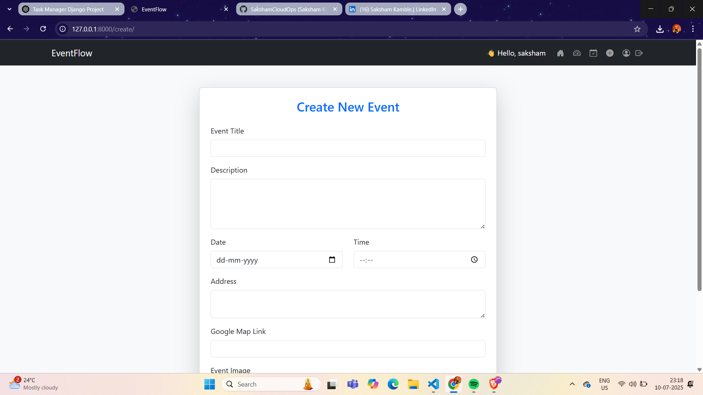
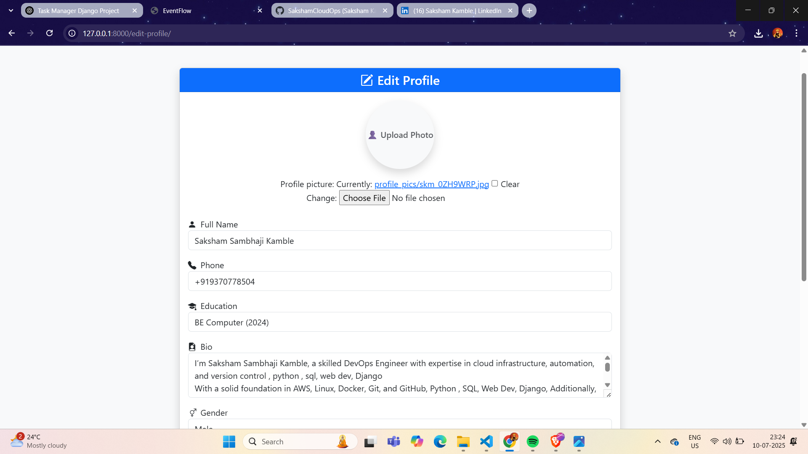
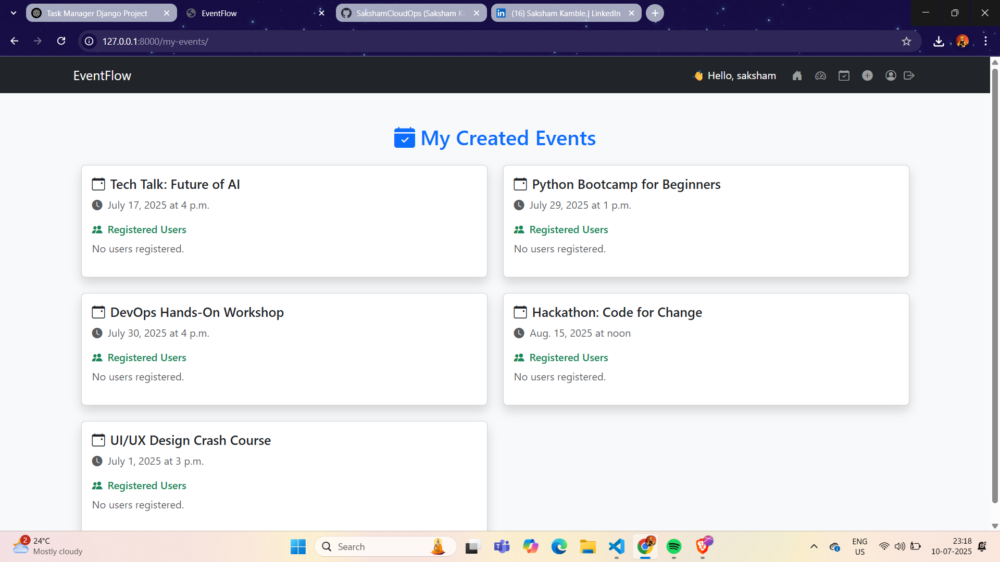

# 🎉 EventFlow – Django-Based Event Management System

EventFlow is a full-stack Django web application designed for creating, managing, and registering for events. It offers an intuitive user experience for both organizers and participants.

---

## 🚀 Features

- ✅ User Registration & Authentication  
- ✅ Create, Edit, and Delete Events  
- ✅ View Your Created Events  
- ✅ User Profile Management  
- ✅ Event Registration System  
- ✅ Email Notifications  
- ✅ Responsive Design with Bootstrap 5

---

## 📸 Screenshots

| Feature         | Screenshot |
|----------------|------------|
| Home Page      |  |
| Create Event   |  |
| Edit Profile   |  |
| My Events Page |  |

---

## 🧰 Tech Stack

- **Frontend**: HTML, CSS, Bootstrap 5  
- **Backend**: Django 5.x  
- **Database**: SQLite (Default)  
- **Authentication**: Django Auth  
- **Image Upload**: Django Media Storage  
- **Email**: SMTP (Gmail)

---

## 🛠 Setup Instructions

### 1. Clone the repository

```bash
git clone https://github.com/SakshamCloudOps/EventFlow.git
cd EventFlow
```

### 2. Create a virtual environment

```bash
python -m venv env
env\Scripts\activate  # On Windows
```

### 3. Install dependencies

```bash
pip install -r requirements.txt
```

### 4. Run migrations

```bash
python manage.py makemigrations
python manage.py migrate
```

### 5. Start the development server

```bash
python manage.py runserver
```

Visit: http://127.0.0.1:8000/

---

## 🧪 Sample Test Users

| Username   | Password   | Role         |
|------------|------------|--------------|
| `admin`    | `admin123` | Superuser    |
| `testuser` | `test123`  | Event Creator|

---

## 📁 Project Structure

```
EventFlow/
├── events/                 # Main Django App
├── templates/
│   ├── events/
│   └── accounts/
├── static/
├── media/
├── db.sqlite3
├── requirements.txt
├── manage.py
└── README.md
```

---

## 👨‍💻 Author

**Saksham Sambhaji Kamble**  
📫 sakshamskm.kamble@gmail.com  
🔗 [GitHub](https://github.com/SakshamCloudOps)

---

## 🙌 Support

If you like this project, don’t forget to ⭐ the repo and share your feedback!

